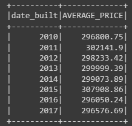
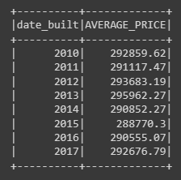
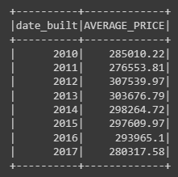
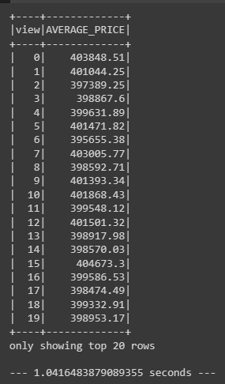
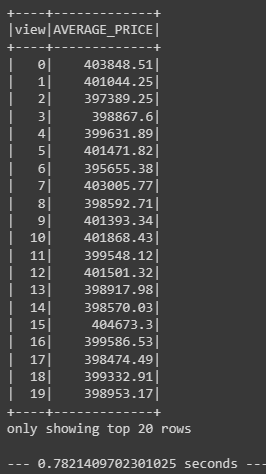

# Home_Sales
Module 22 Challenge

# Introduction
In this challenge, we were asked to use our knowledge of SparkSQL to determine key metrics about home sales data. Then we used Spark to create temporary views, partition the data, cache and uncache a temporary table, and verify that the table had been uncached.

# Results
Answer the following questions using SparkSQL:

1. What is the average price for a four-bedroom house sold for each year? Round off your answer to two decimal places.

2. What is the average price of a home for each year it was built that has three bedrooms and three bathrooms? Round off your answer to two decimal places.

3. What is the average price of a home for each year that has three bedrooms, three bathrooms, two floors, and is greater than or equal to 2,000 square feet? Round off your answer to two decimal places.

4. What is the "view" rating for homes costing more than or equal to $350,000? Determine the run time for this query, and round off your answer to two decimal places.

  Original data

   

5. Using the cached data, run the query that filters out the view ratings with average price greater than or equal to $350,000. Determine the runtime and compare it to uncached runtime.

  Cached data

   

  Parquet formatted data

   

Both the cached data and the Parquet formatted data have faster runtimes compared to the original data .

In conclusion, Parquet formatted data demonstrates the best runtime among the three options (Run time for original data, cached data and parquet formatted data).